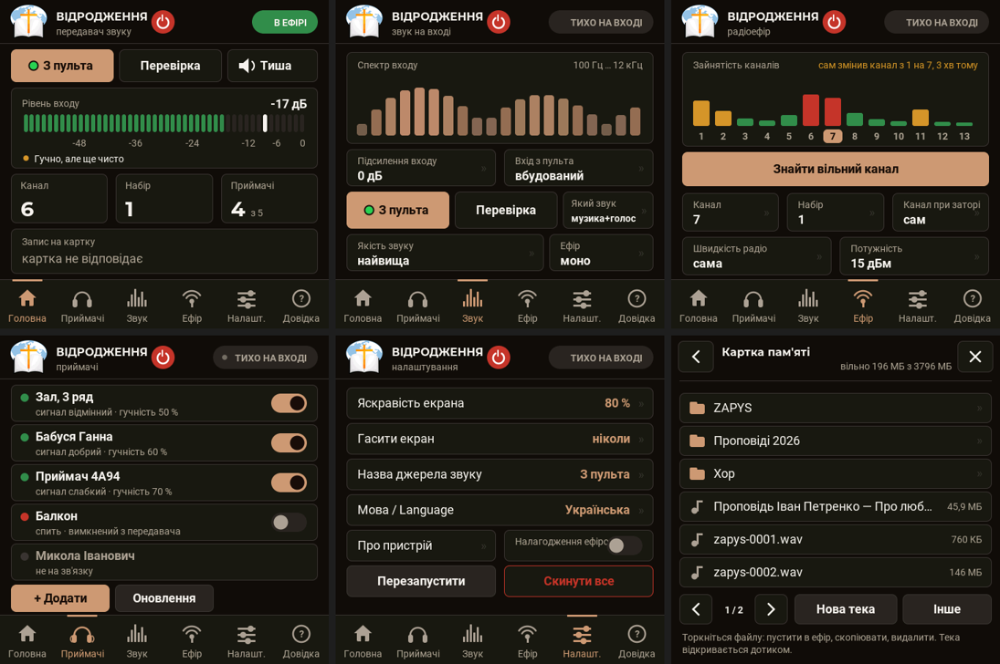

# HearLink — a digital wireless listening kit for hard-of-hearing people

**English** · [Українська](README.uk.md)

A transmitter takes the sound from a mixing desk and broadcasts it over encrypted digital radio to receivers with
headphones. A hard-of-hearing person can sit anywhere in the hall, set their own volume and hear the sermon or the
choir right in their ears — no room echo, no wires, no induction loop in the floor.

The kit was built for the «Відродження» (“Revival”) church. Everything is made of off-the-shelf modules, with no
fine-pitch soldering. One firmware runs on every board: whether a board is a transmitter or a receiver is stored
in the board itself.

 
 

## Features

**Transmitter** (ESP32-4848S040 module with a 4″ touch screen)
- line-level audio from the desk, 32 kHz; four quality levels — from “highest” (uncompressed, 12–15 ms latency)
  to “far” (the most interference-proof);
- mono or stereo on air;
- finds a free Wi-Fi channel by itself and leaves a channel that gets congested — receivers follow without a gap;
- receiver list: who is online, signal, loss, volume; each receiver can be named, muted, switched off,
  asked to “identify itself”, and have its speech clarity, balance and volume limit set remotely;
- over-the-air firmware update of receivers; the transmitter itself updates from a file on the memory card;
- recording the broadcast to the card (WAV), playing MP3/WAV files from the card on air, a file manager;
- test sounds (tone, voice, music, music with announcements), input level meter and spectrum;
- on-screen help, Ukrainian and English UI.

**Receiver** (ESP32-S3 board + SH1106 display with a rotary knob)
- headphones directly on the board pins or through an amplifier;
- a single knob: turn — volume, press — mute, long press — menu;
- three main-screen views: spectrum, needle meters, large volume number;
- speech clarity (treble boost +4/+8/+12 dB), left/right balance, volume limit, headphone test;
- a “Link” screen with a one-minute signal graph;
- falls asleep when the transmitter is silent and wakes up by itself; while asleep the screen, audio and radio are off — it listens to the air twice a second;
- RGB status LED, smooth animations, notifications.

**Security.** Everything on air is encrypted and signed (hardware AES-128). A foreign receiver cannot hear the
sound and a foreign transmitter cannot inject its own. A receiver is added from the transmitter screen by
comparing a four-digit code.

## What it can be used for

- churches, assembly halls, lecture rooms — assistive listening (the main purpose);
- simultaneous interpretation: the interpreter speaks into a desk microphone, listeners use headphones;
- guided tours and “silent” events where loudspeakers are unwanted;
- wireless monitoring for a sound engineer or a choir;
- quiet TV listening at home;
- recording a service to the memory card and playing background music from it.

> This is not a medical device and not a hearing aid. Headphone volume can be high — use the “Volume limit”.

## Documentation

| | |
|---|---|
| [Hardware and wiring](docs/en/hardware.md) | what to buy, how to connect, power and antenna requirements |
| [Installation](docs/en/install.md) | flashing ready-made files (macOS, Windows, Linux), building from source |
| [User guide](docs/en/user-guide.md) | transmitter, receiver, pairing, updates, memory card |
| [Serial commands and debugging](docs/en/commands.md) | every command, measurement tools, hands-free testing |
| [How it works](docs/en/technical.md) | radio, audio, encryption, OTA, flash layout, pitfalls |
| [Development and debugging](docs/en/development.md) | building, mandatory checks, screen simulators, crash dumps, how to add features |
| [Troubleshooting](docs/en/troubleshooting.md) | what to do when something is wrong |
| [Changelog](CHANGELOG.md) | version history |

## Quick start

1. Download `hearlink-…-flash-kit.zip` from the [latest release](../../releases/latest).
2. Flash the receiver board and the transmitter module — see [Installation](docs/en/install.md).
3. Wire everything according to the [schematics](docs/en/hardware.md).
4. On the transmitter: “Приймачі / Receivers” → “+ Add”, compare the code on both screens, “Allow”.

## Project status

The working version is **2.34**. Bench-tested: one transmitter and two receivers, hours of continuous operation,
over-the-air updates, sleep and wake-up. Range in a large hall and the acoustic microphone-to-ear latency have not
been measured yet — see [How it works](docs/en/technical.md#not-verified).

Source comments are in Russian; on-screen texts are in Ukrainian and English.

## License

The whole product — firmware, tools, schematics, documentation and media — is our own work and is distributed
freely under the [MIT License](LICENSE): use it, change it, build it, sell devices based on it; just keep the
copyright notice. All media content (test music, voice announcements, illustrations) was generated with AI and is
covered by the same license. The only exception is the module photos in `docs/photos/`: they belong to the
modules' manufacturers and sellers.

## Third-party components

Roboto (Apache 2.0) and Montserrat (SIL OFL 1.1) fonts as bitmap tables; the U8g2 library (BSD-2); the
Arduino-ESP32 core / ESP-IDF (Apache 2.0, LGPL) including the Helix MP3 decoder; esptool (GPL-2.0) in the flashing
kit. Details: [NOTICE.md](NOTICE.md).
