# User guide

[← back to main page](../../README.md) · [Українська](../uk/user-guide.md)

## Transmitter

After power-on — the splash screen (about 4 s; sound goes on air from the very first second), then the home page.
At the bottom there are six tabs, at the top — the page title, the power-off button and the status "pill"
(«В ЕФІРІ» (ON AIR), «ТИХО НА ВХОДІ» (INPUT SILENT), «ПЕРЕВАНТАЖЕННЯ» (OVERLOAD), «ТИША» (MUTE)).

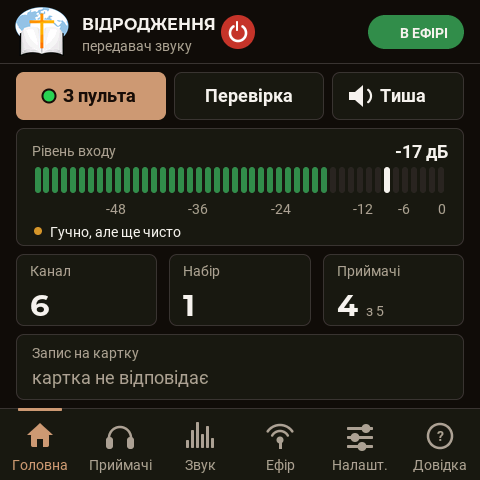 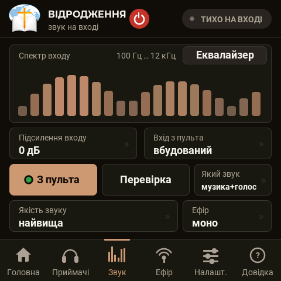

### «Головна» (Home)
- **«З пульта» (Mixer) / «Перевірка» (Test) / «Тиша» (Mute)** — what goes on air: the sound from the input, the
  test sound, or silence (packets are sent, there is no sound in them — the receivers do not fall asleep).
- **«Рівень входу» (Input level)** — in dB, with a peak mark and a hint («Тихо» (Quiet), «Гучно, але ще чисто»
  (Loud but still clean), «Перевантаження — зменшіть рівень на пульті» (Overload — reduce the level on the mixer)).
- Tiles **«Канал» (Channel)**, **«Набір» (Kit)**, **«Приймачі» (Receivers)** (how many are online out of all),
  **«Запис на картку» (Recording to card)**.

### «Звук» (Sound)
The input spectrum; **«Підсилення входу» (Input gain)** (−12…+24 dB); **«Вхід» (Input)** (built-in ADC or PCM1808);
**«Який звук» (Which sound)** in test mode (tone, voice, voice and music, music, music with an announcement every
N seconds, left/right channel check) with a choice of tune and volumes; **«Якість звуку» (Sound quality)**;
**«Ефір» (Air)** mono/stereo.

| Quality | On air | Added delay | Lowest radio rate | When to choose |
|---|---|---|---|---|
| «найвища» (highest) | 32 kHz uncompressed | 2 ms | 5.5 Mbit/s | hall up to ~15 m, clean air, music |
| «стандартна» (standard) | 32 kHz ADPCM | 4 ms | 2 Mbit/s | the usual choice |
| «мова» (speech) | 16 kHz ADPCM (up to 7 kHz) | 8 ms | 1 Mbit/s | sermon, busy air |
| «дальня» (far) | 16 kHz ADPCM | 12 ms | 0.5 Mbit/s | the longest range, mono only |

If the selected quality "does not fit" into the current radio rate, the nearest lower one goes on air — the menu
shows this («мова — за швидкістю» (speech — due to rate)).

### «Ефір» (Air)

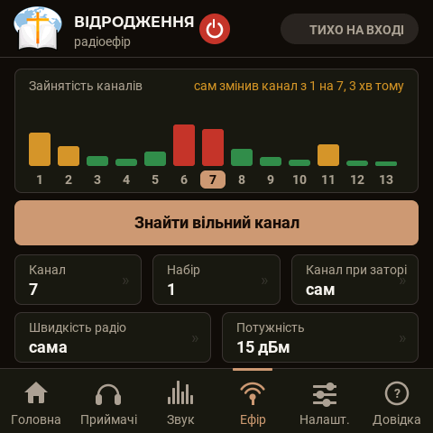

- **«Зайнятість каналів» (Channel occupancy)** and the button **«Знайти вільний канал» (Find a free channel)** (the
  sound is interrupted for two seconds).
- **Channel** 1–13; **Kit** — the number of your kit (receivers hear only their own).
- **«Канал при заторі: сам» (On congestion: auto)** — if for five seconds out of eight the packets wait for the
  air, the transmitter moves to a freer channel by itself; it announces the move to the receivers in advance, and
  they move without a pause. The channel it left is not chosen for ten minutes.
- **«Швидкість радіо: сама» (Radio rate: auto)** — the transmitter looks at the weakest receiver and steps through
  11 → 5.5 → 2 → 1 → 0.5 Mbit/s. The most reliable is 5.5 and lower.
- **«Потужність» (Power)** 2–20 dBm.

### «Приймачі» (Receivers)

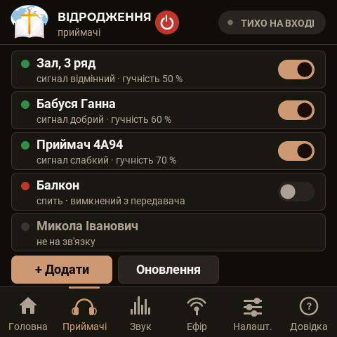 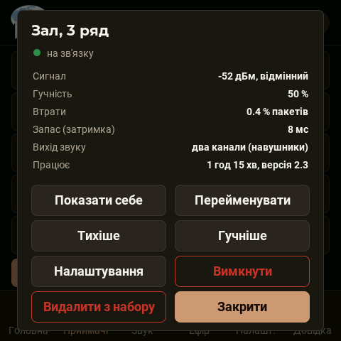

A receiver row: name, signal, volume; the switch on the right turns the receiver off or on remotely (a receiver
that is turned off falls asleep and is woken only by the "turn on" command or by a double press of its own knob).
Touching the row opens the receiver window: signal, volume, loss, buffer, output, uptime and version; the buttons
**«Показати себе» (Identify)** (the receiver blinks white, shows «ЦЕ Я» (IT'S ME) on its screen, beeps in the
headphones), **«Перейменувати» (Rename)** (up to 32 letters), **«Тихіше / Гучніше» (Quieter / Louder)**,
**«Налаштування» (Settings)**, **«Вимкнути» (Turn off)**, **«Видалити з набору» (Remove from kit)**.

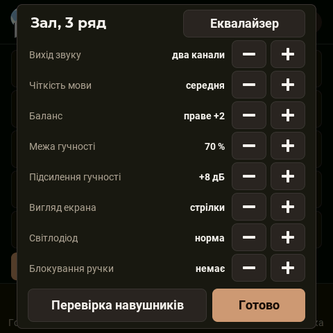

**Settings** of a receiver from the transmitter: audio output, speech clarity, balance, volume limit, screen view,
LED, interface language, the button **«Перевірка навушників» (Headphone test)**.

#### Adding a receiver

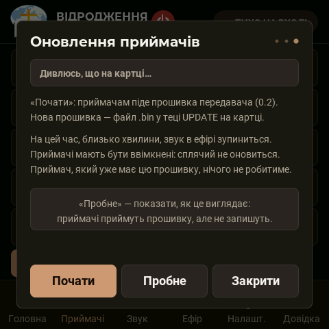

1. Switch the new receiver on next to the transmitter. Its screen shows «НЕ ПІДКЛЮЧЕНО» (NOT CONNECTED), then
   «прошу доступ» (asking for access) and a four-digit **«КОД» (CODE)**.
2. On the transmitter: «Приймачі» (Receivers) → **«+ Додати» (+ Add)**. The window stays open for three minutes; a
   request with the same code appears in it.
3. Compare the code and press **«Дозволити» (Allow)**. The receiver gets the kit key and starts playing.

A receiver that already has a key does not listen to other transmitters. It can be moved to another kit only on the
receiver itself: menu → «Забути набір» (Forget kit).

#### Removing a receiver
"Remove from kit" — the receiver loses access, the kit key changes and is distributed to the remaining receivers by
itself (to those that were switched off — when they are switched on). A lost receiver will hear nothing after this.

### Firmware update

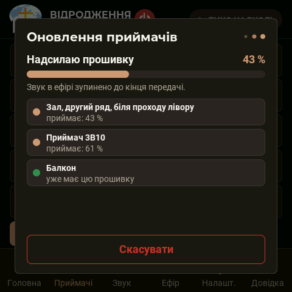 

**Via the memory card (no cable needed):**
1. Put the file `hearlink-<version>.bin` from the [releases](../../../releases/latest) on the card (FAT32) into the
   **`UPDATE`** folder in the card root: `UPDATE/hearlink-2.34.bin`. The transmitter creates the folder by itself.
   The file name can be anything, only the `.bin` extension is required: the transmitter reads the version from
   inside the file and takes the newest of several files. Do not put the cable-flashing parts here
   (`bootloader.bin`, `partitions.bin`, `boot_app0.bin`, `assets.bin`).
2. Insert the card — the transmitter finds the file and opens the «Оновлення» (Update) window.
3. **«Оновити» (Update)**: first the receivers over the radio (about 15 s of sending, the sound on air is stopped
   for this time; writing in the receivers takes another 15–30 s), then the transmitter writes itself (about a
   minute, the screen blinks — it shows in large letters «ОНОВЛЕННЯ ПРОШИВКИ — НЕ ВИМИКАЙТЕ ЖИВЛЕННЯ!!!»
   (UPDATING FIRMWARE — DO NOT SWITCH POWER OFF!!!)) and restarts.

**Automatically** (since 2.42): when a receiver with firmware older than the transmitter's comes on the air (it was
switched off or asleep during the update, or it is a new one), the transmitter starts the distribution by itself
after about 10 s. The sound on air stops for ~20 s for everyone; at most two attempts per receiver per power-on of
the transmitter. Switch off / on: port commands `M7` / `M6`.

**Receivers only** (the transmitter already has the new version): "Receivers" → "Update" → **«Почати» (Start)**.
**«Пробне» (Trial)** — shows what it looks like: the receivers receive and verify everything but write nothing.

A sleeping receiver will not be updated — update it another time. An interrupted update breaks nothing: until the
new firmware has been written and verified in full, the receiver starts from the old one.

### Memory card

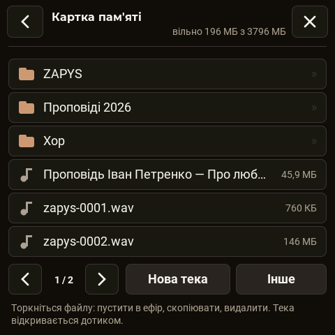 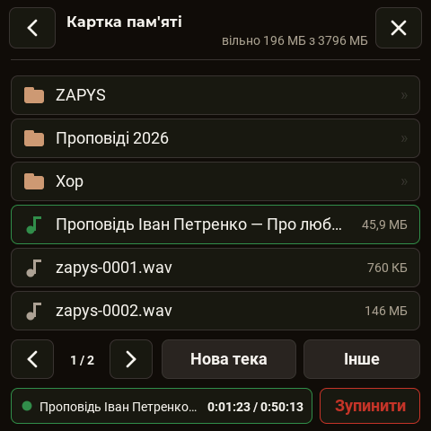

- **Recording the broadcast** — the "Recording to card" tile on the home page: WAV 32 kHz mono 16 bit, about 230 MB
  per hour, folder `ZAPYS`. The file header is updated every five seconds — on a sudden power-off no more than that
  is lost.
- **«Файли» (Files)** — a file manager: folders, viewing text files, copying, deleting, new folder, formatting.
- **File on air** — touch an MP3 or WAV file → «В ефір» (On air): the file plays instead of the input (background
  music before the service).
- The `LOG` folder — the log of the radio "black box"; the `UPDATE` folder — updates.

### «Налаштування» (Settings)
Screen brightness, screen dimming (never / 1 / 5 / 15 min), the sound source name (the caption on the button instead
of «З пульта» (Mixer)), language (Українська / English — the receivers pick it up by themselves), «Про пристрій»
(About), «Налагодження ефіром» (Debug over air), **«Перезапустити» (Restart)**, **«Скинути все» (Reset all)**.

The power-off button in the header: the air goes silent, the screen goes dark; a touch on the screen turns it on.
After 10 s without a signal the receivers fall asleep by themselves.

## Receiver

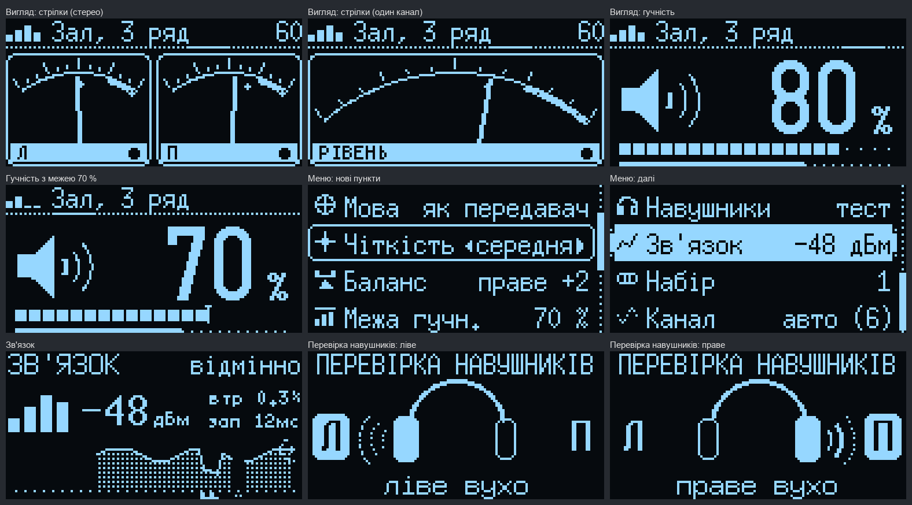

### Knob
| Action | On the main screen | In the menu |
|---|---|---|
| turn | volume 0…100 % (step 5 %) | select an item / change a value |
| press | mute / sound | enter an item / confirm |
| long press (0.7 s) | menu | back |
| any movement while the screen is off | turn the screen on | — |
| press while asleep | wake up and search for the transmitter for 10 s | — |
| double press when turned off from the transmitter | turn itself on | — |

### What it shows

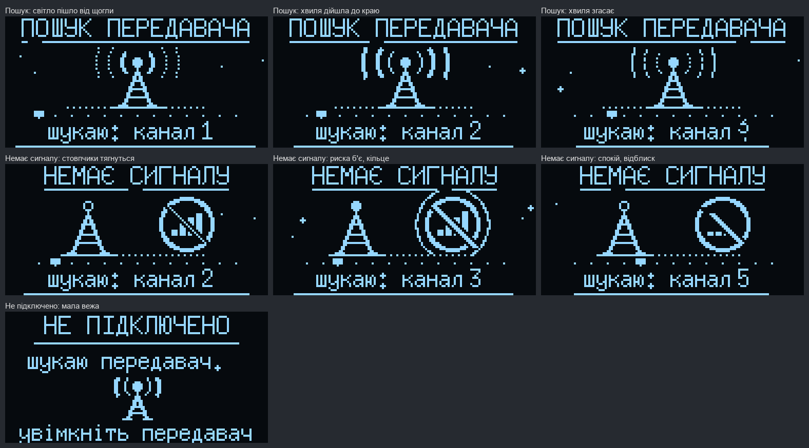

| Screen | When |
|---|---|
| splash screen (4 s) | power-on, wake-up |
| «ПОШУК ПЕРЕДАВАЧА» (SEARCHING) — a tower with waves, a channel scale | searches for 10 s, then falls asleep |
| «ЗАПУСК» (STARTING) — a 4 s bar | the transmitter has been found; the sound comes in after 1.5 s, smoothly |
| main screen | operation |
| «НЕМАЄ СИГНАЛУ» (NO SIGNAL) — a tower without waves and a crossed-out sign | the signal is gone; sleep after 10 s |
| «ТИША» (MUTE) | the knob was pressed |
| «НЕ ПІДКЛЮЧЕНО» (NOT CONNECTED) + code | the receiver is not in a kit yet |
| «ОНОВЛЕННЯ» (UPDATING) with progress | an over-the-air update is in progress |
| «ЦЕ Я» (IT'S ME) | "Identify" was pressed on the transmitter |

At the top of the main screen — the signal level (four bars), the name, the volume. Notifications slide in from the
top: «Сигнал відновлено» (Signal is back), «Слабкий сигнал» (Weak signal), «Гучно на вході!» (Input too loud!),
«Тиша в ефірі» (Silence on air), «Межа гучності» (Volume limit), «Чіткість: середня» (Clarity: medium) (a setting
was changed from the transmitter) and so on.

### Menu
| Item | Values |
|---|---|
| **«Вигляд» (View)** | spectrum / needles / volume (a large number) |
| **«Світлодіод» (LED)** | off / dim / normal / bright |
| **«Мова» (Language)** | as transmitter / українська / English |
| **«Чіткість» (Clarity)** | off / light (+4 dB) / medium (+8) / strong (+12) — a boost above 2 kHz, where the consonants are |
| **«Баланс» (Balance)** | left +1…+5 / center / right +1…+5 (3 dB each); only with the «2 канали» (2 channels) output |
| **«Межа гучн.» (Volume limit)** | 20…100 % — the loudness ceiling: the knob scale stays 0…100 %, but 100 % sounds like this limit (since 2.41) |
| **«Навушники → тест» (Headphones → test)** | a tone alternately in the left and the right ear |
| **«Зв'язок» (Link)** | signal in dBm, loss, buffer, a one-minute graph |
| «Набір» (Kit) | kit number (display only) |
| «Канал» (Channel) | auto or 1–13 |
| «Запас» (Buffer) | «сам» (auto) or 4–40 ms — a buffer against uneven air (it is also the delay) |
| «Вихід звуку» (Audio output) | PDM / PCM5102 (restart) |
| «Виводи» (Pins) | 2 channels / «протифаза» (antiphase) |
| «Екран» (Screen) | turn off (any knob movement turns it on) |
| «Забути набір» (Forget kit) | erase the key — the receiver will ask for access again |
| «Про пристрій» (About) | version, channel, kit, number, buffer, signal |

### LED
| Color | State |
|---|---|
| not lit | asleep, turned off from the transmitter |
| blinks blue | startup, search, signal gone |
| slowly "breathes" green | working, silence on air |
| "breathes" yellow | working, sound on air |
| blinks red for 6 s | transmitter not found, falling asleep |
| "breathes" purple | firmware update |
| blinks white rapidly | "Identify" (even when the LED is turned off) |

### Sleep
10 s without a signal → 6 s of a message → sleep: the screen, the audio output and the radio are off, the processor
sleeps. Once every half second the receiver turns the radio on for 0.07 s and listens to its channel (every fourth
cycle — the remaining channels). Once it hears its transmitter, it wakes up by itself: splash screen, "STARTING",
sound.
