# Обладнання та схеми

[← до головної](../../README.uk.md) · [English](../en/hardware.md)

## Що потрібно

### Передавач (1 шт.)

| Вузол | Що саме | Примітки |
|---|---|---|
| Модуль | **ESP32-4848S040** (він же ESP32-4848S040C_I): ESP32-S3-WROOM-1U **N16R8**, екран 4″ 480×480 (ST7701), ємнісний сенсор GT911, гніздо microSD, міст USB CH340 | потрібна саме версія з 16 МБ флеш і 8 МБ PSRAM |
| Антена | зовнішня 2,4 ГГц на роз'єм IPEX (U.FL) | модуль «1U» без антени майже не чути: на столі −45…−68 дБм замість −14 |
| Живлення | блок 5 В, **не менше 1 А** | від порту ноутбука не живити: струм в імпульсі великий, порт «відвалюється» |
| Вхід звуку | 4 резистори 10 кОм, конденсатори 1 мкФ і 4,7 нФ, фільтр зміщення 1 кОм + 100 мкФ | на роз'ємі H1 немає 3,3 В, тому зміщення береться від 5 В через фільтр |
| Розв'язка (бажано) | ізолятор «земляної петлі» 3,5 мм між пультом і передавачем | прибирає гул 50 Гц |
| Картка пам'яті (за бажанням) | microSD, FAT32 | запис ефіру, файли в ефір, оновлення |
| Зовнішній АЦП (за бажанням) | модуль **PCM1808** | стерео й менший шум; у прошивці є, **на модулі 4848 не перевірено** |

### Приймач (на кожного слухача)

| Вузол | Що саме | Примітки |
|---|---|---|
| Плата | **ESP32-S3-DevKitC-1 N16R8** (або сумісна з 16 МБ флеш і 8 МБ PSRAM) | PSRAM потрібна для оновлення по радіо: образ 2,2 МБ приймається в пам'ять цілком |
| Екран із ручкою | модуль «M75»: OLED **SH1106 1,3″ 128×64 I2C** + енкодер **EC11** з кнопкою | живити **тільки від 3,3 В**: підтяжки I2C на модулі йдуть до VCC |
| Вихід звуку | навушники напряму: на кожне плече 1 кОм + 10 нФ і розділовий конденсатор 1 мкФ | або підсилювач навушників із різницевим входом (MAX97220) |
| Зовнішній ЦАП (за бажанням) | модуль **PCM5102** | чистіший звук: шум живлення процесора в навушники не потрапляє; див. розділ нижче |
| Живлення | повербанк або акумулятор із виходом 5 В | екран не обов'язковий: без нього приймач просто грає |

Плата приймача може бути й без екрана та ручки — тоді ним керують із передавача (гучність, вимкнення, усі
налаштування).

## Як виглядають модулі

### Фотографії

| | |
|---|---|
| 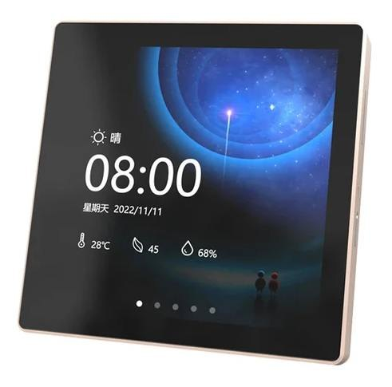 | **ESP32-4848S040** — модуль передавача, лицьовий бік: сенсорний екран 4″ |
| 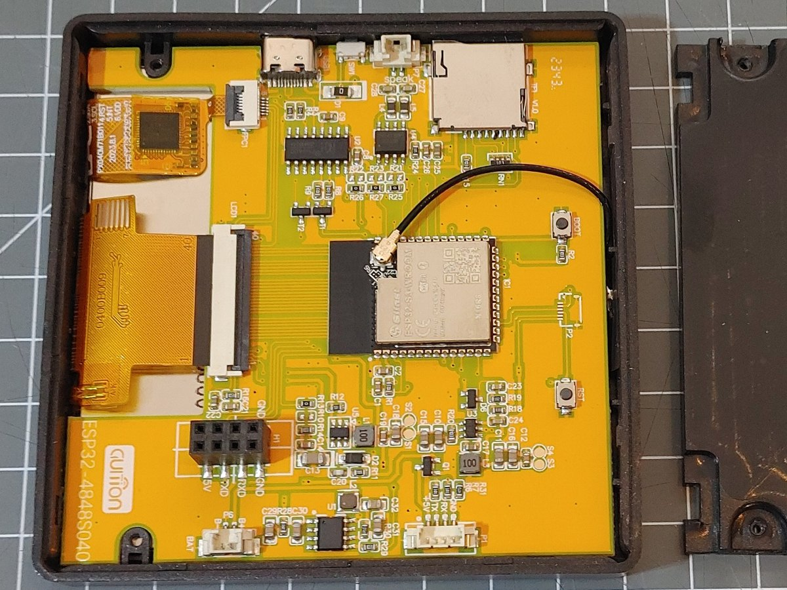 | **ESP32-4848S040**, зворотний бік: модуль ESP32-S3 з антеною на дроті, гніздо microSD, USB-C, роз'єм H1 |
| 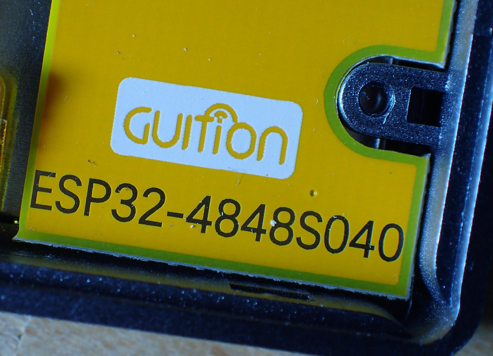 | напис на корпусі модуля — за ним його й шукати |
| 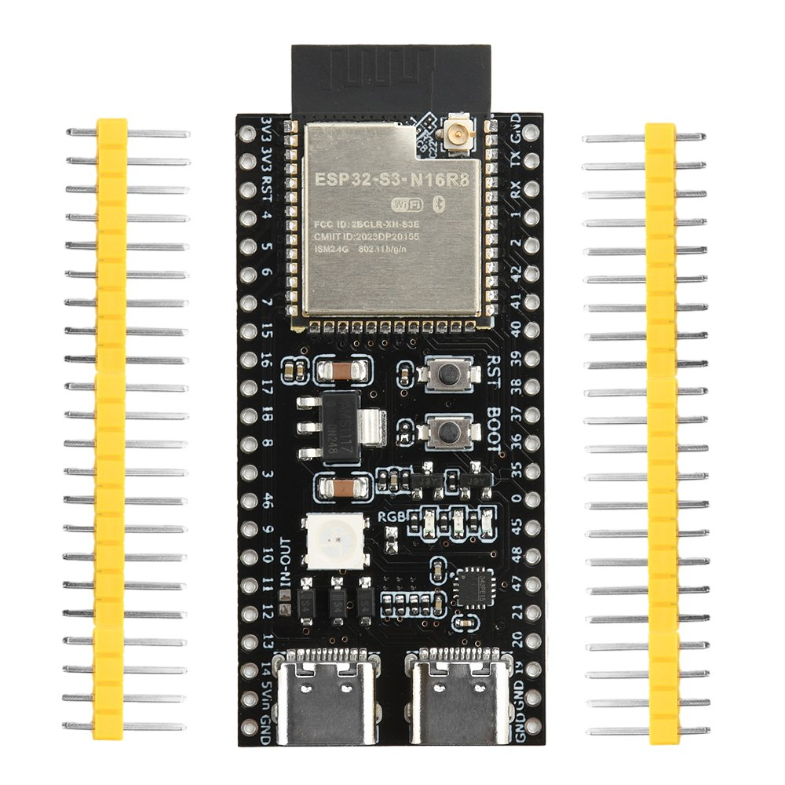 | **ESP32-S3 N16R8** — плата приймача (два роз'єми USB-C, кнопки BOOT і RST, кольоровий світлодіод) |
| 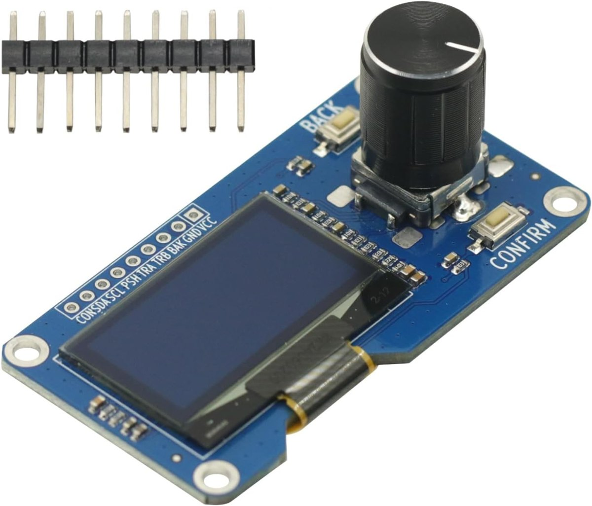 | **екран SH1106 1,3″ з енкодером EC11** і кнопками BACK / CONFIRM |
| 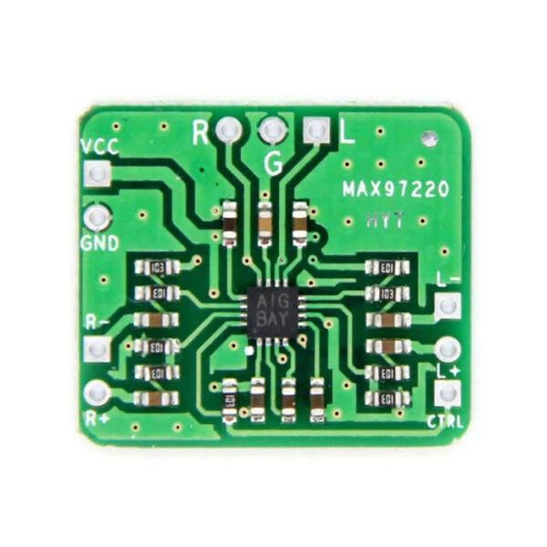 | **MAX97220** («HYT») — підсилювач навушників (за бажанням): входи L+, L−, R+, R−, вихід R, G, L, живлення VCC, GND, керування CTRL |
| 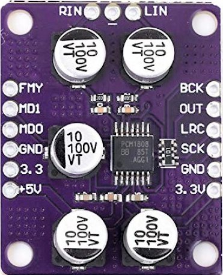 | **PCM1808** — зовнішній АЦП передавача (за бажанням) |
| 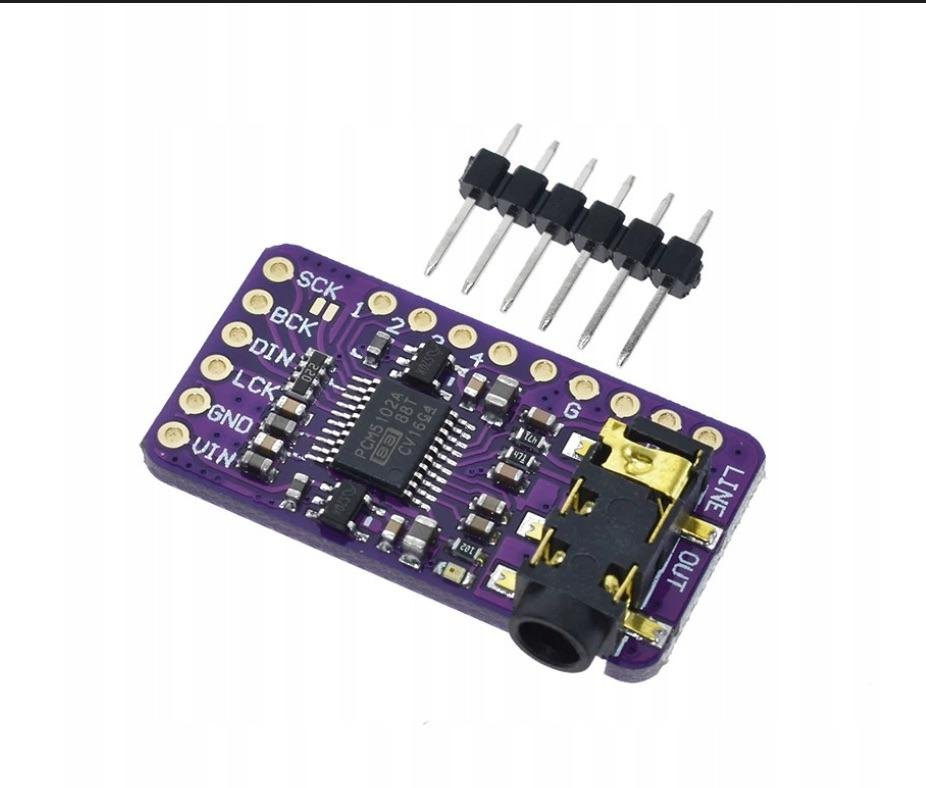 | **PCM5102** — зовнішній ЦАП приймача (за бажанням) |

Фотографії модулів належать їхнім виробникам і продавцям; ліцензія MIT проєкту на них не поширюється.

### Малюнки з підписами виводів

Малює їх `tools/gen_modules.py`. Розташування деталей умовне — виводи звіряйте з написами на своїй платі.

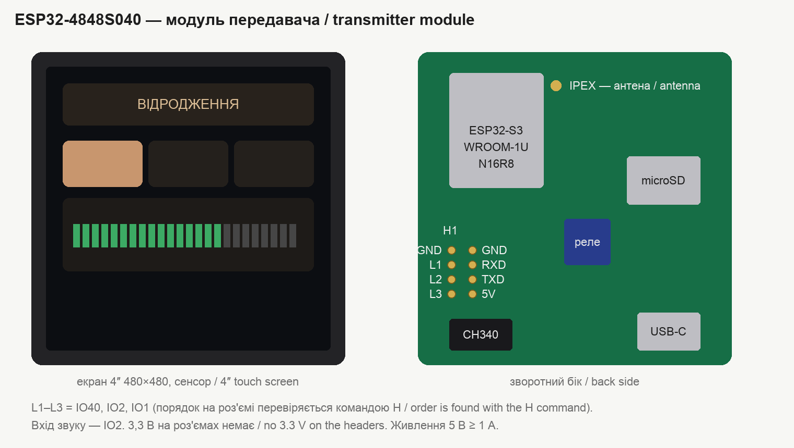
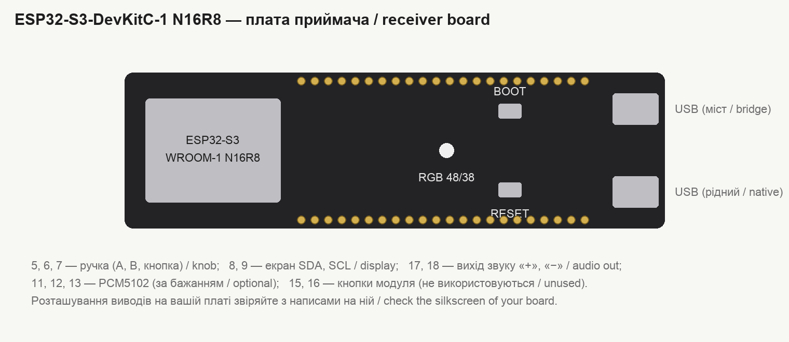
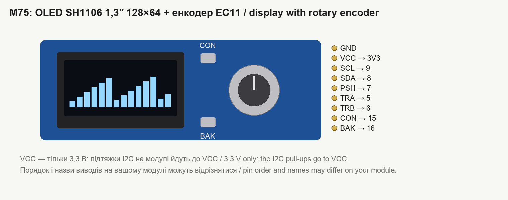
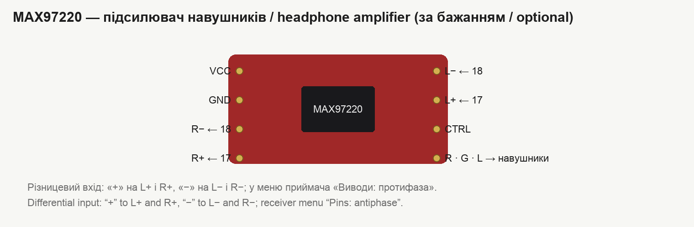
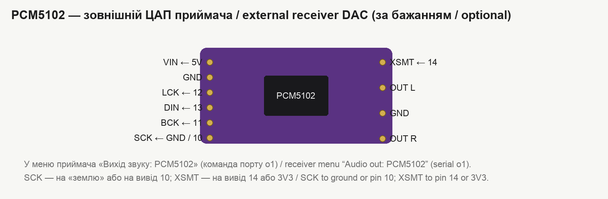
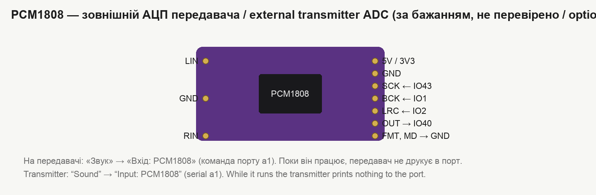

Справжній вигляд плати ESP32-S3-DevKitC-1 — у документації виробника:
<https://docs.espressif.com/projects/esp-dev-kits/en/latest/esp32s3/esp32-s3-devkitc-1/>. Решту модулів легко
знайти за назвою: «ESP32-4848S040», «SH1106 1.3 OLED EC11», «MAX97220 module», «PCM5102 module», «PCM1808 module».

## Виводи

### Приймач (ESP32-S3)

| Призначення | Вивід |
|---|---|
| Екран SDA, SCL | 8, 9 |
| Ручка: A (TRA), B (TRB), кнопка (PSH) | 5, 6, 7 |
| Кнопки модуля CON, BAK (не використовуються, підтягнуті) | 15, 16 |
| Вихід звуку «+», «−» (однобітний PDM) | 17, 18 |
| PCM5102: BCK, LCK, DIN, XSMT; SCK — на GND (або на вивід 10, там нуль) | 11, 12, 13, 14 |
| Кольоровий світлодіод плати (WS2812) | 48 (у нових плат — 38) |

### Передавач на модулі ESP32-4848S040

| Призначення | Вивід |
|---|---|
| Вхід звуку (вбудований АЦП) | IO2 |
| PCM1808: MCLK, BCK, LRCK, DOUT | IO43 (TXD), IO1, IO2, IO40 |
| Картка пам'яті SPI: SCK, MOSI, MISO, CS | 48, 47, 41, 42 |
| Сенсор GT911 SDA | 19 |
| Підсвітка | 38 |

Вільних виводів на модулі лише три: IO1, IO2, IO40 (на роз'ємі H1 вони підписані L1–L3; порядок на роз'ємі
знаходиться командою порту `H`). Коли працює PCM1808, вихід порту (TXD) зайнятий тактом АЦП — передавач нічого не
друкує в порт, але команди приймає. З версії 2.56 такт подається на цей вивід лише тоді, коли вхід
PCM1808 справді йде в ефір: з перевірочним звуком чи файлом із картки в ефірі порт працює як звичайно (докладніше — на
початку [«Команди порту»](commands.md)). Вбудований АЦП — лише для перевірки без зовнішнього АЦП: з ним радіо
передавача часом «стає» на 0,2 с (вбудований АЦП і радіо ділять один вузол мікросхеми).

### Передавач на звичайній платі ESP32-S3 (без екрана)

Вхід звуку — вивід 4 (АЦП), PCM1808 — 10 (SCK), 11 (BCK), 12 (LRC), 13 (OUT). Керування — тільки з порту.

## Схеми

Передавач на модулі з екраном, вхід — вбудований АЦП:

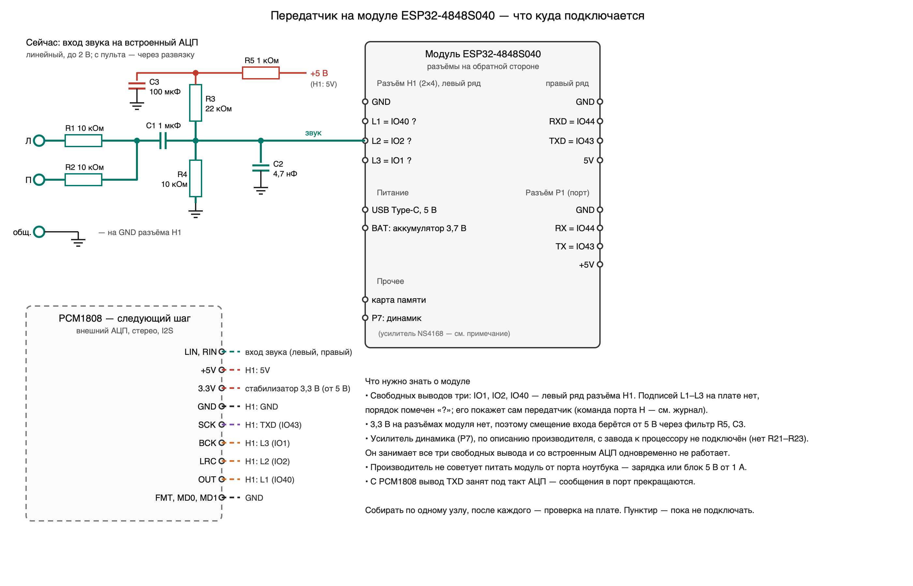

Вхід: R1, R2 по 10 кОм складають лівий і правий канали пульта, R3, R4 по 10 кОм задають зміщення посередині,
C1 1 мкФ відділяє постійну складову, C2 4,7 нФ зрізає радіочастоти. Сигнал послаблюється вдвічі; на вхід можна
подавати до 2 В.

Приймач, навушники напряму до плати:

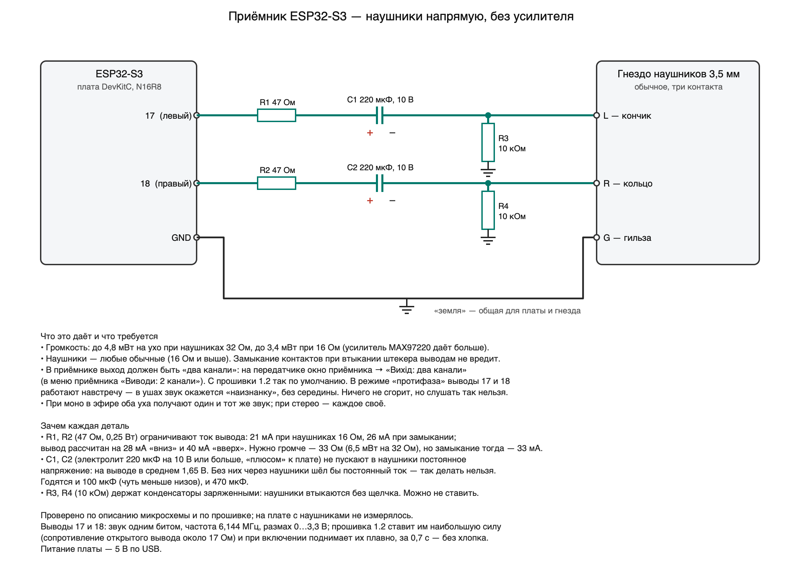

Приймач із підсилювачем навушників (вихід «протифаза»):

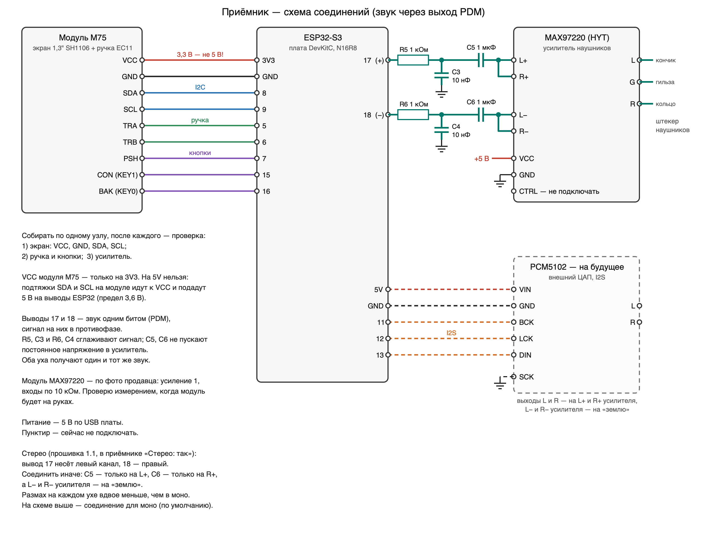

Варіанти із зовнішніми перетворювачами (не перевірені на платах):
[передавач + PCM1808](../skhema-peredatchik-4848-pcm1808.png),
приймач + PCM5102 — у розділі нижче.

Схеми малює `tools/gen_schema.py`; є також у SVG.

## Зовнішній ЦАП PCM5102 на приймачі

Модуль — фіолетова плата GY-PCM5102 (PCM5102A, два стабілізатори 3,3 В, гніздо 3,5 мм; на виходах послідовно по
470 Ом — тому навушники можна вмикати просто в гніздо).

| Вивід модуля | Куди | Навіщо |
|---|---|---|
| VIN | 5V приймача | живлення (на модулі свої стабілізатори 3,3 В) |
| GND | GND | |
| BCK | **11** | такт бітів, 1,024 МГц |
| LCK (LRCK) | **12** | такт каналів, 32 кГц |
| DIN | **13** | дані I2S, 16 біт |
| SCK | **GND** (або вивід 10 — приймач тримає на ньому нуль) | головний такт не подається: ЦАП відновлює його з BCK сам |
| XSMT | **14** (або 3V3) | «звук увімкнено». З 2.63 приймач тримає тут «землю» від першого рядка запуску й піднімає рівень, лише коли звук справді пішов (див. нижче «Без хлопків») |
| FLT | **GND** або 3V3 — тільки не «в повітрі» | цифровий фільтр: GND — звичайний, 3V3 — із малою затримкою |
| DEMP | **GND** або 3V3 — тільки не «в повітрі» | корекція передспотворень: GND — вимкнено, 3V3 — увімкнено (верхи м'якші) |
| FMT | **GND** | формат I2S |

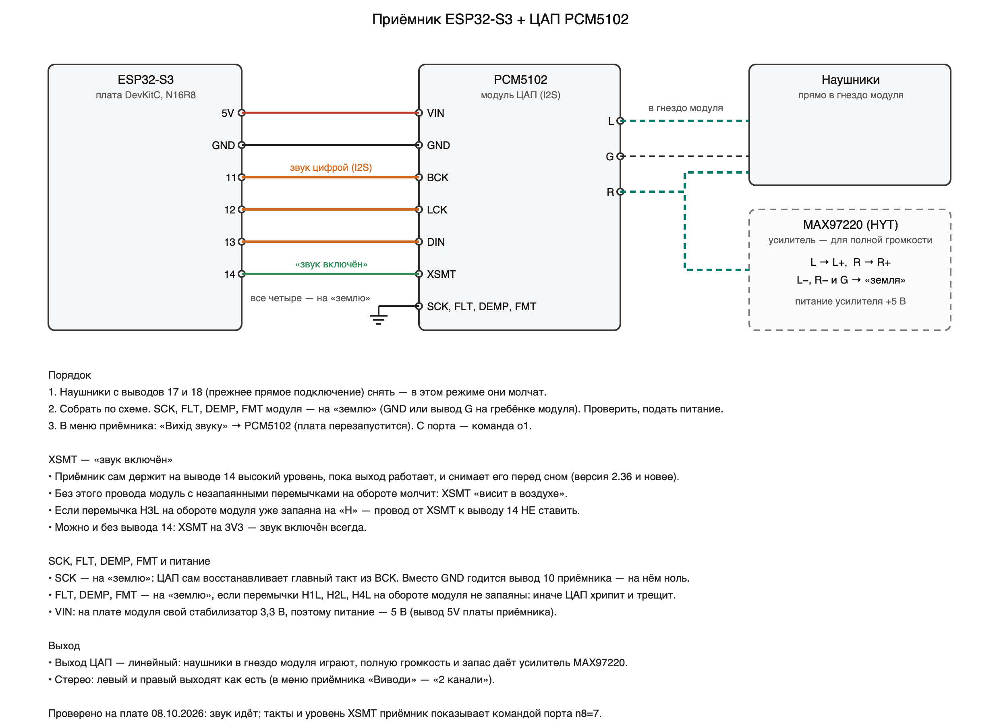

**Без хлопків у навушниках.** Щоб ЦАП мовчав, поки приймач завантажується, XSMT має бути на виводі 14 (а не на
3V3 і не перемичкою H3L на «H»). З версії 2.63 прошивка: (1) ставить вивід 14 у «землю» першим же рядком запуску;
(2) піднімає його, лише коли приймач у роботі й звук пішов (заставка й початок «запуску» минають із заглушеним
ЦАП), і опускає, щойно робота скінчилась; (3) перед будь-яким перезапуском плати спершу глушить ЦАП і втримує
«землю» на виводі крізь перезапуск. Одного прошивка зробити не може: від подачі живлення до її запуску (частки
секунди) вивід процесора нічим не керується. Якщо хлопок **при вмиканні живлення** лишається — поставте резистор
10–47 кОм між XSMT і «землею»: він тримає ЦАП заглушеним, доки прошивка не візьме вивід на себе.

### Підсилювач навушників MAX97220 після ЦАП

З гнізда модуля PCM5102 до навушників 32 Ом доходить близько 6 % напруги ЦАП: на виходах модуля стоять резистори
470 Ом. Тому «на повну» з навушниками напряму тихо, і цифрове «Підсилення» тут не допоможе — гучніше за повну шкалу
ЦАП цифрою не зробити. Запас дає підсилювач навушників: модуль MAX97220 («HYT») віддає в навушники всю напругу ЦАП.

| Площадка модуля | Куди |
|---|---|
| L+, R+ | лівий і правий вихід ЦАП |
| L−, R− | «земля» ЦАП (AGND) |
| VCC, GND | живлення; краще 5 В — від 3,3 В на найгучніших місцях можливий зріз |
| CTRL | на «плюс» — підсилювач увімкнено (за описом мікросхеми) |
| R, G, L | навушники |

- **Підсилення модуля — одиниця.** Усі резистори біля мікросхеми — 10 кОм. Напис «E01» на частині з них — це ті
  самі «103», припаяні догори ногами.
- **Щоб підняти підсилення**, зменшують резистор на вході «+»: підсилення = 2 · 10 кОм / (10 кОм + R). З 470 Ом
  це 1,9 (+5,6 дБ), з перемичкою — 2 (+6 дБ). Але на навушники 32 Ом мікросхема віддає приблизно до 2 В при
  живленні 5 В, а ЦАП на повній шкалі дає 2,1 В — тож із підсиленням 2 на великій гучності вона зрізає піки.
  Тоді в приймачі ставлять «Межа гучності» близько 85 % (5 В) чи 70 % (3,3 В).
- **«Підсилення» в меню приймача з підсилювачем тримають на нулі**, гучність регулюють ручкою; для слухачів варто
  обмежити «Межа гучності» — 100 % тепер справді гучно.

Числа про напругу й зріз — розрахунок за описом мікросхеми, на платі не виміряні.

**Головне — жоден керівний вивід мікросхеми не має «висіти в повітрі».** За схемою модуля чотири виводи (FLT, DEMP,
XSMT, FMT) задаються перемичками H1L–H4L на звороті, і зазвичай модуль приходить із запаяними: H1L → L, H2L → L,
H3L → H, H4L → L; SCK замкнений на «землю» краплею припою біля виводу. **Трапляються модулі з незапаяними
перемичками** — тоді ці входи нічим не задані (внутрішніх підтяжок у мікросхеми немає), і ЦАП або мовчить (XSMT),
або хрипить і тріщить (FMT, FLT, DEMP ловлять наведення від сусідніх ліній). Ліки без паяння — дроти з гребінки
модуля: FLT, DEMP і FMT на сусідній вивід AGND (G) тієї ж гребінки, XSMT — на вивід 14 приймача. Або запаяти
перемички, як у таблиці.

| Перемичка | Вивід ЦАП | Що задає | Як має бути | Якщо інакше |
|---|---|---|---|---|
| H1L | FLT | цифровий фільтр | **L** або **H** | L — звичайний фільтр, H — із малою затримкою; «в повітрі» — клацання, «бруд» у звуку |
| H2L | DEMP | корекція передспотворень 44,1 кГц | **L** або **H** | L — звук як є, H — верхи м'якші; «в повітрі» — «бруд» у звуку |
| H3L | XSMT | приглушення | **H** | L або «в повітрі» — тиша |
| H4L | FMT | формат даних | **L** (I2S) | H — інший формат: гучний шум замість звуку; «в повітрі» — хрип |

**Перевірено на приладі (09.10.2026).** На приймачі з модулем, у якого H1L, H2L і H4L не були запаяні, звук ішов із
цифровим «брудом»: фонове дзижчання на деяких гармоніках, «ніби дуже низька дискретизація» — хоча сигнал до ЦАП був
правильний біт у біт (`n8=9`). Після запаювання **H1L → H, H2L → H, H4L → L** (H3L → H уже була) бруд зник, звук
чистий. Тобто запаяні мають бути всі чотири перемички; у робочому приймачі набору стоїть саме це поєднання.

Про H2L → H: це корекція передспотворень, розрахована на 44,1 кГц; на наших 32 кГц вона приглушує верхи — за
розрахунком приблизно −2 дБ на 2 кГц, −5 дБ на 4 кГц, −8 дБ на 8 кГц (не виміряно). Якщо мові бракує чіткості —
підняти верхи на приймачі («Чіткість», смуги еквалайзера 2,5 і 6 кГц) або запаяти H2L → L.

- Якщо перемичку H3L запаяно на «H» — вивід 14 до XSMT **не під'єднувати**; якщо SCK на модулі вже замкнений на
  «землю» — нікуди його більше не вести.
- У меню приймача: «Вихід звуку» → **PCM5102** (плата перезапуститься); з порту — `o1`. Навушники з виводів 17/18
  у цьому режимі мовчать.
- Що саме йде на ЦАП, приймач показує сам: `n8=7` — чи «тремтять» BCK, LRCK і дані, рівні SCK та XSMT; `n8=9` —
  знімає сигнали з виводів і друкує біти одного слова (перевірка формату).
- Документація: [PCM5102A, Texas Instruments](https://www.ti.com/lit/ds/symlink/pcm5102a.pdf) — режим без головного
  такту (розділ 9.3.5.3, таблиця 11: 32 кГц при BCK 1,024 або 2,048 МГц), вхід XSMT (9.3.3).

## Два способи під'єднати навушники

У меню приймача «Виводи» (і на передавачі: вікно приймача → «Налаштування» → «Вихід звуку»):

- **2 канали** — на виводі 17 лівий канал, на 18 правий; навушники напряму або стереопідсилювач. Працюють стерео
  й баланс.
- **протифаза** — один і той самий звук на двох виводах у протифазі: удвічі більший розмах для підсилювача з
  різницевим входом. З навушниками, під'єднаними напряму, у цьому режимі звук «навиворіт» — його не вмикати.

Виводи 17 і 18 поставлені на найбільший струм (до 40 мА). Гучність у навушниках напряму залежить від їхнього опору:
з 32 Ом тихіше, ніж із підсилювачем.

## Послідовність збирання

1. Спершу прошити плату ([Встановлення](install.md)) і переконатися, що вона запускається.
2. Під'єднати **тільки екран** — перевірити заставку. Потім ручку. Потім звук. По одному вузлу за раз: так видно,
   що саме не працює.
3. Перед подачею живлення перевірити, що VCC екрана на 3V3, а не на 5V.
4. Звук від пульта під'єднувати останнім і з малого рівня.
